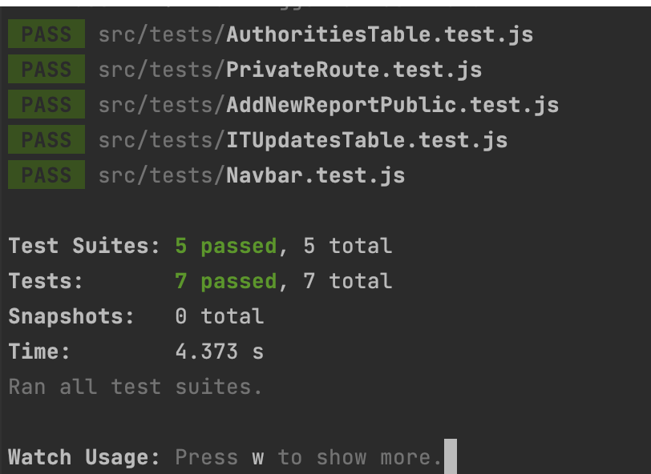
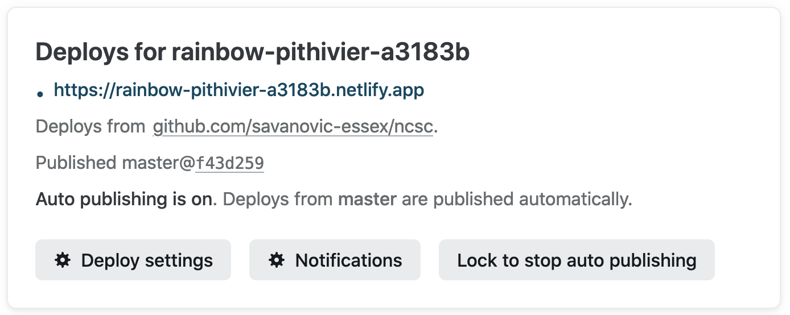
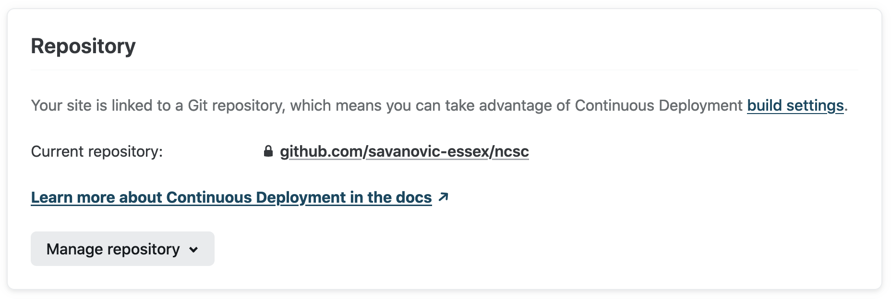
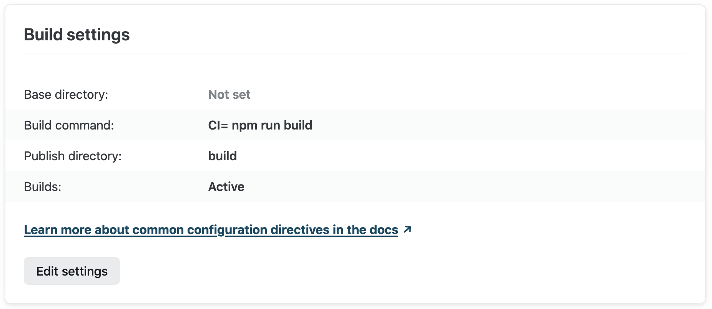
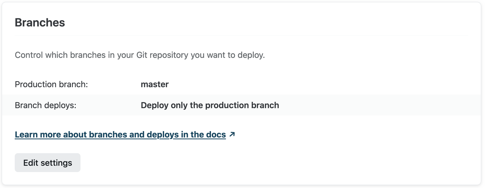
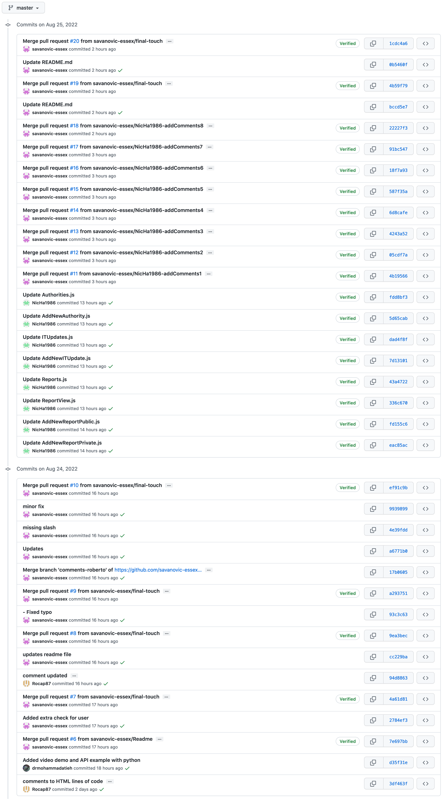
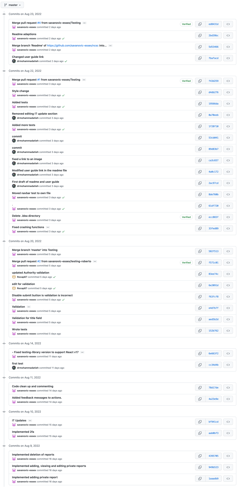
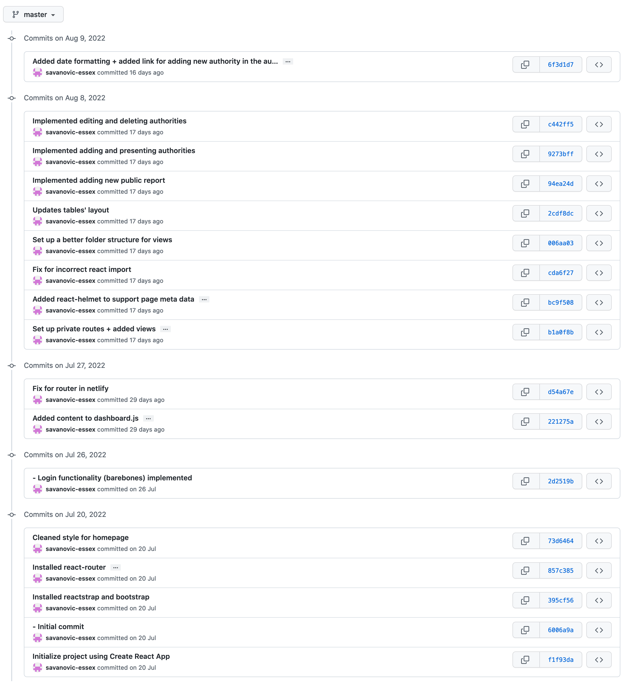

# Dutch National Cyber Security Center
For a better user experience with the README file, we advise you to read it directly in GitHub, on the following link:

[https://github.com/savanovic-essex/ncsc](https://github.com/savanovic-essex/ncsc)
# Table of Contents
- [Dutch National Cyber Security Center](#dutch-national-cyber-security-center)
- [Table of Contents](#table-of-contents)
- [About](#about)
- [User Guide](#user-guide)
- [Getting Started with Create React App](#getting-started-with-create-react-app)
  - [Available Scripts](#available-scripts)
    - [`npm install`](#npm-install)
    - [`npm start`](#npm-start)
    - [`npm test`](#npm-test)
    - [`npm run build`](#npm-run-build)
    - [`npm run eject`](#npm-run-eject)
    - [Linter](#linter)
  - [Testing](#testing)
  - [Deployment](#deployment)
  - [Learn More](#learn-more)
  - [Demonstrations of development over the lifetime of the module](#demonstrations-of-development-over-the-lifetime-of-the-module)
    - [Code Splitting](#code-splitting)
    - [Analyzing the Bundle Size](#analyzing-the-bundle-size)
    - [Making a Progressive Web App](#making-a-progressive-web-app)
    - [Advanced Configuration](#advanced-configuration)
    - [Learn more about Firebase](#learn-more-about-firebase)
- [References](#references)
# About

This web application is a team project that was implemented as a part of the Secure Software Development course at the University of Essex Online. It represents a proposed solution for the Dutch National Cyber Security Center (NCSC) as a department under the National Coordinator of Counterterrorism and Security of the Government of the Netherlands to manage cases of suspected internet crime in accordance with the national counterterrorism and cybersecurity policy (Government of the Netherlands, N.D.). In addition, the NCSC helps public authorities in providing information about new IT software and hardware trends and updates which is also part of the application.Also, there is a page reserved for reporting cybersecurity threats that can be accessed by the general public. In general, the focus is on functionality and security. Functionality is manifested in simple CRUD operations. Security relies on the principle of “Defense in Depth”. This application was build using Firebase platform and ReactJS library, in addition to other tools for implementation and testing. More information are available at [Getting Started with Create React App](#getting-started-with-create-react-app), and [Learn more about Firebase](#learn-more-about-firebase) sections.

# User Guide

For a detailed application user guide, please refer to this link: [User Guide](userguide/UserGuide.md)

# Getting Started with Create React App

This project was bootstrapped with [Create React App](https://github.com/facebook/create-react-app).

## Available Scripts

In the project directory (root), you can run:

### `npm install`

This is the first script that needs to be executed after cloning this project to your local machine.
By executing this script, you will install all necessary dependencies, which allow this app to run.

### `npm start`

Runs the app in the development mode.\
Open [http://localhost:3000](http://localhost:3000) to view it in your browser.

The page will reload when you make changes.\
You may also see any lint errors in the console.

### `npm test`

Launches the test runner in the interactive watch mode.\
See the section about [running tests](https://facebook.github.io/create-react-app/docs/running-tests) for more information.

### `npm run build`

Builds the app for production to the `build` folder.\
It correctly bundles React in production mode and optimizes the build for the best performance.

The build is minified and the filenames include the hashes.\
Your app is ready to be deployed!

See the section about [deployment](https://facebook.github.io/create-react-app/docs/deployment) for more information.

### `npm run eject`

**Note: this is a one-way operation. Once you `eject`, you can't go back!**

If you aren't satisfied with the build tool and configuration choices, you can `eject` at any time. This command will remove the single build dependency from your project.

Instead, it will copy all the configuration files and the transitive dependencies (webpack, Babel, ESLint, etc) right into your project so you have full control over them. All of the commands except `eject` will still work, but they will point to the copied scripts so you can tweak them. At this point you're on your own.

You don't have to ever use `eject`. The curated feature set is suitable for small and middle deployments, and you shouldn't feel obligated to use this feature. However we understand that this tool wouldn't be useful if you couldn't customize it when you are ready for it.

### Linter
Since this project was bootstrapped by a tool called "create-react-app", we were fortunate enough to have a linter included directly in the project.
When one runs the project locally, the linter output will be displayed directly in the terminal/console.
We are using a basic configuration, intended for React.js. There are options to update the configuration in ``package.json`` file under the ``eslintConfig`` section (create-react-app.dev, n.d.).
For more information about the linter, you can visit this [link](https://create-react-app.dev/docs/setting-up-your-editor/).

## Testing
In the screenshot below, you can see the outcome of running all five test suites, as well as their seven tests.
We decided to test some primary functionalities, such as changing local state, i.e. editing input fields.
Apart from that, there are a few tests, where we expect data, which is delivered to a components to be presented as such.
There are also two tests, which focus on security of the routing - expecting to serve a private route when a user is logged in and vice versa.
One final test is based on presenting components, i.e. checking whether they are being rendered properly by React.js

We have also provided you with a video demonstration of the app, which also serves as proof for manual testing of all features.
This video can be found in the [User Guide section](userguide/UserGuide.md).

## Deployment

This application has been deployed with the help of [Netlify](https://www.netlify.com/). Our code repository has been connected to Netlify, where certain settings were adapted.

In the two screenshots below, you can see the assigned URL for our app, as well as the repository connection.

One of the main settings is the build function: ``npm run build``.

Apart from this, we have also set the ``master`` branch to be used as the deployment branch, meaning whenever there is a change on this branch, Netlify will trigger a new build.

## Learn More

If you want to have full access to this app, make sure to contact one of the group members, so we can set up an account for you.
Otherwise, you will only be able to access the homepage, the login page and the public report submission page. 

You can learn more in the [Create React App documentation](https://facebook.github.io/create-react-app/docs/getting-started).

To learn React, check out the [React documentation](https://reactjs.org/).

## Demonstrations of development over the lifetime of the module

In the following screenshots, you can see the full history of commits and mergers through pull requests, demonstrating the development over the lifetime of the module.

## Creation and setup of a Cyber Specialist account

In order for a Cyber Specialist to be able to access the NCSC App, they need an account which is created for them by a Super Admin.
On the following [link](https://drive.google.com/file/d/1i6mW4Ny6jn9AliZLAuckWfsKUK1gSF8w/view?usp=sharing), you can watch a video of a Super Admin creating an account and requesting a password reset.

The second step is necessary for enabling the 2FA.
Afterwards, the Cyber Specialist receives a password reset email, with a link for a web form in which they can set up their new password.

The final step includes a Super Admin enabling 2FA for the newly created account.
Even though the Super Admin inputs a password during the account creation process, the Cyber Specialist will not be able to log in with that password, because their 2FA is not set up in that moment of time.

Link for video:
[https://drive.google.com/file/d/1i6mW4Ny6jn9AliZLAuckWfsKUK1gSF8w/view?usp=sharing](https://drive.google.com/file/d/1i6mW4Ny6jn9AliZLAuckWfsKUK1gSF8w/view?usp=sharing).

### Code Splitting

This section has moved here: [https://facebook.github.io/create-react-app/docs/code-splitting](https://facebook.github.io/create-react-app/docs/code-splitting)

### Analyzing the Bundle Size

This section has moved here: [https://facebook.github.io/create-react-app/docs/analyzing-the-bundle-size](https://facebook.github.io/create-react-app/docs/analyzing-the-bundle-size)

### Making a Progressive Web App

This section has moved here: [https://facebook.github.io/create-react-app/docs/making-a-progressive-web-app](https://facebook.github.io/create-react-app/docs/making-a-progressive-web-app)

### Advanced Configuration

This section has moved here: [https://facebook.github.io/create-react-app/docs/advanced-configuration](https://facebook.github.io/create-react-app/docs/advanced-configuration)

### Learn more about Firebase

To learn more about Firebase: [https://firebase.google.com](https://firebase.google.com)

# References
create-react-app.dev. (n.d.). Setting Up Your Editor | Create React App. Available from: https://create-react-app.dev/docs/setting-up-your-editor/ [Accessed 24 Aug 2022].
Government of the Netherlands (n.d.) Fighting Cybercrime in the Netherlands.Available from: https://www.government.nl/topics/cybercrime/fighting-cybercrime-in-the-netherlands [Accessed 17 July 2022]

