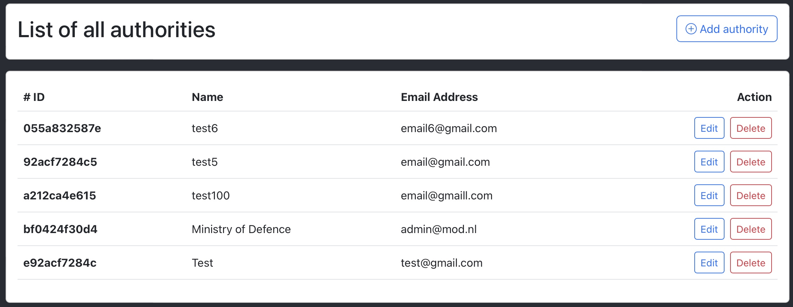

# User Guide

# Table of Contents
- [User Guide](#user-guide)
- [Table of Contents](#table-of-contents)
  - [Introduction](#introduction)
  - [Homepage](#homepage)
    - [Submit a Public Report](#submit-a-public-report)
    - [Cyber Specialist Dashboard](#cyber-specialist-dashboard)
      - [Login](#login)
      - [Reports](#reports)
      - [Authorities](#authorities)
      - [IT Updates](#it-updates)
  - [Video Demonstration](#video-demonstration)
  - [Realtime Database API](#realtime-database-api)

## Introduction

A link to the deployed web application can be found [here](https://rainbow-pithivier-a3183b.netlify.app).

## Homepage

The homepage of the application will look as the screen shot below. The home page contains two links. The first one is for submitting a [public report](#submit-a-public-report), the second link for cyber specialist [login](#login).

### Submit a Public Report

This page is reserved for public use. It can be accessed by any individual of the general public who is willing to submit a suspected cybersecurity threat for review by a cyber security specialist. The public report submission page looks like the following:

### Cyber Specialist Dashboard

#### Login

User accounts for the security specialists are managed by the superadmin through [Firbase Authenticaiton](https://firebase.google.com/docs/auth). Two factor authentication is required by the users to be able to access their accounts, a password that they create after receiving a password reset email, and an OTP that they receive on their mobile devices. The login page looks like the following:

After successful login, the cyber specialist will be directed to a dashboard that contains three main divisions. One for private reports, the second one for authorities and the third for IT updates. The dashboard looks like the following:

#### Reports

This division can be used for adding private reports and viewing all the available reports.

Adding a report:

Viewing list of reports:

In addition, public and private reports can be opened for editing and adding more details.

Editing a private report:

#### Authorities

This division can be used for adding public authorities that can be later informed about cybersecurity threats after adding them to selected reports.

Adding an authority:

Viewing list of authorities:

Editing an authority:

#### IT Updates

This division can be used for adding IT Updates that can be later forwarded to public authorities.

Adding an IT Update:

Viewing list of IT Updates:

## Video Demonstration

You can a view a quick demonstration of the application [here](https://drive.google.com/file/d/1DBB4jvgYAo-cHd9jv75YFjlQoHh-mhtE/view?usp=sharing)
## Realtime Database API 

The Firebase Realtime Database has an API that can be accessed with different programming languages. An example of an API request for submitting a public report to the realtime database using python is presented [here](/userguide/api.py). For more information about Firebase Realtime Database Rest API, please visit this [link](https://firebase.google.com/docs/database/rest/start).

